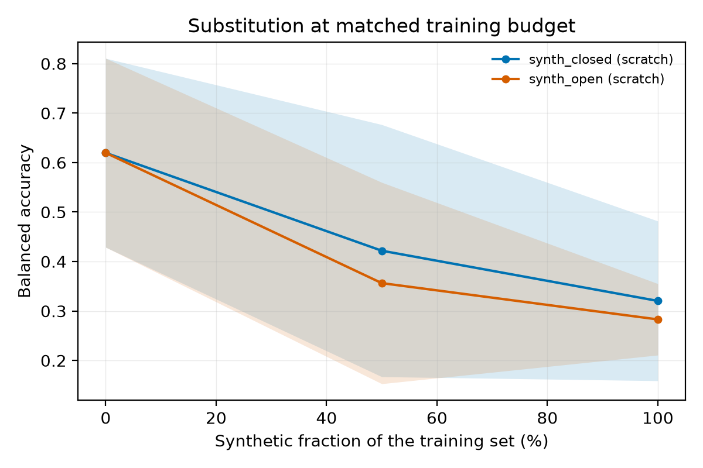

# fake_it_til_you_make_it

**Can generated images train a traditional classifier? A controlled study on acne
severity grading.**

The name is a nod to [Sariyildiz et al., CVPR 2023](https://arxiv.org/abs/2212.08420).
The question they asked of ImageNet, we ask of a small, imbalanced, clinically
meaningful dataset — where the answer is much less obvious and much more consequential.

## The question

Most published work shows that adding synthetic images to real ones *helps*. That is a
weak claim and it is well established. We are after the two harder ones:

- **Substitution** — can synthetic images *replace* real ones, at a matched training budget?
- **Exchange rate** — how many synthetic images buy one real image, and does that number
  blow up as you scale?

Concretely: train a fixed classifier on mixtures of real and generated acne images at
**0% / 25% / 50% / 75% / 100% synthetic**, holding the total number of training images
constant, and evaluate every arm on the *same sealed real test set*.

## Status

| | |
|---|---|
| Literature review | ✅ `docs/01_related_work.md` — **verification pass 1 and 2 done**, see `docs/VERIFY.md` |
| Study protocol | ✅ `docs/02_study_design.md` |
| Environment audit | ✅ `docs/03_environment.md` |
| Codebase | ✅ `src/fitymi/`, verified end-to-end — see `docs/examples/` |
| **ACNE04 data audit** | ✅ **`docs/05_acne04_audit.md` — a finished result in its own right, drafted as `paper/audit.tex`** |
| Real-only baseline | ✅ balanced accuracy **0.747** subject-disjoint, **0.792** image-level (5 seeds each) |
| Closed-set generator | 🚧 LoRA fine-tuning on Apple Silicon |
| Generation + mixing sweep | ⛔ ~60 GPU-hours after that |
| Paper | ✅ `paper/audit.tex` complete · 🚧 `paper/main.tex` awaits the sweep |

## The benchmark turned out to be broken, and that is the first result

Before any synthetic image existed, deduplicating ACNE04 for the splits surfaced
something larger. `docs/05_acne04_audit.md` has the whole thing; none of it needs a GPU,
a model, or anything but the public archive:

- **5.2% of files are byte-identical duplicates.** 38 pairs, eight of which carry
  conflicting severity grades and 26 conflicting lesion counts.
- **All five of the dataset's own published folds leak.** On average 4.25% of each test
  split is byte-identical to a training image.
- **The 1,457 photographs are about 600 people.** 15.9% of every published test fold is a
  person who also appears in training, at an identity threshold where 0.019% of image
  pairs qualify by chance — and 77.5% at the ordinary operating point. Published ACNE04
  accuracies measure within-subject, not between-subject, generalisation.
- **The severity label belongs to the annotation team, not the photograph.** An
  independent expert re-annotation of 1,204 of the same images counts 3.2× more lesions
  and agrees with the original grade on 30.1% of them — 58.2% after being granted any
  monotone recalibration.

Reproduce any of it:

```bash
python scripts/audit_acne04.py             # duplicates, fold leakage, label noise
python scripts/audit_acne04_subjects.py    # identity structure and subject leakage
python scripts/compare_acne04_versions.py --v2 <acne04v2>/Acne04-v2_annotations.json
```

Three protocol amendments followed (`docs/02_study_design.md` §12): subject-disjoint
splitting is now mandatory rather than an ablation, every headline comparison is repeated
under the second annotation team's labels, and every synthetic pool is measured for
identity diversity — a generator fitted to this training split is learning from 267
distinct people, and 47 of them at the very-severe grade.

## What we found in the literature

Short version, with the long version and citations in `docs/01_related_work.md`:

- General vision: synthetic-only training closes *part* of the gap to real data but
  **still underperforms for supervised classifiers**, and the gap is attributed to
  generator capability and to a fidelity–diversity trade-off — prettier generators are
  not better data generators.
- Dermatology: consistent gains reported for synthetic **augmentation**, especially for
  underrepresented skin tones. Almost nothing on **substitution**.
- Acne: exactly one prior fully-synthetic result we could find — a StyleGAN2 study
  reporting **97.6%** accuracy training on synthetic and testing on real, which is
  ~11 points *above* the best real-trained ACNE04 result we could find. We think that
  number needs replication under budget control, and replicating it is a large part of
  the point of this repo.
- Nobody has published the mixing curve. That is the gap.

## Design commitments

The four that most of this literature gets wrong, and that we bind ourselves to:

1. **Sealed test set** — the real test split touches nothing: not classifier training,
   not generator training, not prompt or hyperparameter selection. Enforced in code.
2. **Matched budgets** — every arm trains on the same number of images, so "synthetic
   helps" cannot be confused with "more data helps."
3. **Closed-set and open-set generators reported separately** — a generator fine-tuned on
   our real training data and one that has never seen it answer different questions.
4. **Pretraining is a variable, not an assumption** — a "100% synthetic" arm on an
   ImageNet-pretrained backbone has seen 1.3M real images. We report from-scratch and
   pretrained separately.

## Continuing this work elsewhere

[`docs/HANDOFF.md`](docs/HANDOFF.md) holds a paste-ready directive for picking the
project up in a fresh session on a machine with an accelerator and open network.

## Running it

```bash
make install          # venv + package
make test             # 77 unit tests, CPU, ~10s
make smoke            # end-to-end pipeline check on procedural data, CPU, ~20 min
make smoke-null       # the null: gap=0, mixing curve must come out flat
```

`make smoke` runs the *same code paths* as the real study — dedup, group-stratified
splitting, sealed-test enforcement, budget-matched mixing, training, evaluation,
statistics, figures — against a procedural generative process whose synthetic arm is
mis-specified by a tunable `gap`. With `gap>0` the mixing curve must slope down and
the trend test must detect it; with `gap=0` the two processes are identical and the
slope interval must contain zero. If either fails, the analysis code isn't fit to
point at real data.

The mis-specification models **concept error** — the generator's rendered severity
drifts toward the corpus mean, so an image labelled "very severe" may depict a
moderate case. That matters: a first version only narrowed the within-grade
distributions, and synthetic-trained models came out *better*, because cleaner
prototypes of each class are easier to learn from. A gap that doesn't corrupt the
label-image relationship isn't the gap this study is about.

The most recent smoke run recovers the expected behaviour — balanced accuracy
0.620 → 0.422 → 0.320 as the synthetic fraction rises, with the larger-gap open-set
pool below the closed-set one at every point. Artefacts and commentary are in
[`docs/examples/`](docs/examples/).



The real study needs an accelerator and ACNE04. `device: auto` resolves
CUDA → MPS → CPU, so the committed configs work unchanged on Apple Silicon; see
[`docs/04_running_locally.md`](docs/04_running_locally.md) for the compute budget and
the cuts worth making on a laptop.

```bash
make prepare CONFIG=configs/acne04_closed.yaml   # dedup, split, seal the test set
make finetune                                     # closed-set generator (GPU)
make generate                                     # sample the synthetic pool (GPU)
make sweep                                        # mixing sweep, validation only
make controls                                     # §8 controls
make final                                        # unseals the test set. Once.
make analyse
```

## Layout

```
docs/          literature review, protocol, environment audit, local-run guide,
               citation checklist, smoke-run artefacts
src/fitymi/
  data/        records, ACNE04 loader, dedup, splits, mixing, toy simulator
  generate/    prompts, closed-set fine-tuning, sampling
  train/       backbones and the fixed training recipe
  eval/        metrics and statistics
  controls/    discriminability probe, memorisation audit, skin-tone stratification
  analysis/    aggregation and figures
configs/       one YAML per experimental arm
scripts/       GPU-host driver scripts
tests/         77 tests, no GPU or network required
               (incl. repo-integrity checks: see below)
paper/         arXiv manuscript (LaTeX)
```

## A note on repository integrity

`tests/test_repo_integrity.py` asserts that every source file is tracked and that no
gitignore rule matches one. It exists because a bare `data/` pattern once excluded
`src/fitymi/data/` — the package everything else sits on — and nothing caught it: the
working tree still had the files, so the full suite and the smoke run passed against a
tree the repository did not contain. A fresh clone failed at the first import.

Every directory pattern in `.gitignore` that names a top-level artefact directory is
now anchored with a leading slash. Test runs that back a claim are done against a
fresh clone, not the directory the code was written in.

## A note on the literature review

Every claim in `docs/01_related_work.md` carries a `[V]`/`[S]`/`[?]` verification tag.
They began life entirely at `[S]` — sourced from search summaries, because the authoring
environment blocked every publisher host. Two verification passes on an open network have
since promoted 14 sources to `[V]`; `docs/VERIFY.md` tracks what is left, and six
`refs.bib` entries still carry `NOT INDEPENDENTLY VERIFIED`. Nothing goes into the
manuscript at `[S]`, and `make publication-gate` enforces it.

## Licence

Code: MIT (see `LICENSE`). Data: ACNE04 is academic-use only and is **not** redistributed
here; see `docs/02_study_design.md` §11.
