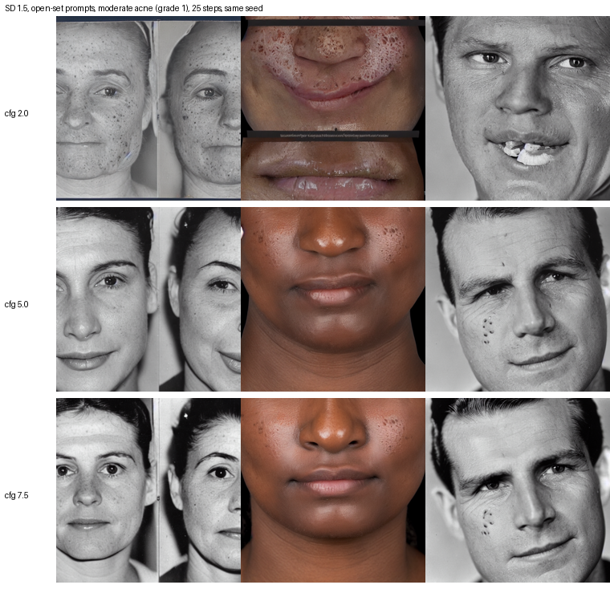

# Study Design / Pre-registration

**Working title:** *Fake It Til You Make It? Measuring the Real-to-Synthetic Exchange
Rate for Acne Severity Classification*

**Status:** draft protocol, v0.1. Written before any experiment is run, deliberately.
Amendments go in §12 with dates — we do not silently edit this file after seeing results.

---

## 1. The question

> Can images generated by a diffusion model substitute for real images when training
> a conventional supervised classifier for acne severity, and at what rate?

Decomposed into three claims we can actually falsify:

- **H1 (substitution).** A classifier trained on 100% synthetic images, evaluated on a
  held-out real test set, is worse than the same classifier trained on an equal number
  of real images. *Directional prediction: yes, and by a wide margin (>10 points
  balanced accuracy).*
- **H2 (monotonicity).** Test performance decreases monotonically as the synthetic
  fraction increases under a fixed training budget. *Directional prediction: yes, but
  with a shallow region at low synthetic fractions — replacing 25% of real images with
  synthetic costs little.*
- **H3 (exchange rate).** There exists a finite ratio *k* such that *k* synthetic images
  recover the performance of one real image, and *k* grows as the real baseline grows.
  *Directional prediction: k is large (≫10) and possibly unbounded — i.e. synthetic
  images saturate and no quantity recovers the real-data performance.*

H3 is the contribution. H1 and H2 are sanity checks that make H3 interpretable.

**Falsifiability.** If the 100%-synthetic arm matches the 0% arm within the confidence
interval, H1 is refuted and the headline result flips to "generated images suffice."
Either outcome is publishable; the design does not privilege one.

---

## 2. Task and label space

**Primary task:** 4-class ordinal acne severity on the Hayashi criterion
(0 = mild, 1 = moderate, 2 = severe, 3 = very severe), as distributed with ACNE04.

**Why ordinal and not binary.** A binary acne/clear task is close to trivial and is
exactly the setup that lets generator artefacts leak into the decision (§8.1). Severity
grading requires the model to count and characterise lesions, which is the capability
we actually doubt a generator can transfer.

**Secondary task (robustness):** binary "clear/mild vs. severe/very severe" collapse of
the same labels, to check that conclusions are not an artefact of ordinal boundary noise.

---

## 3. Data

### 3.1 Real corpus

**ACNE04** (Wu et al., ICCV 2019): 1,457 images, Hayashi severity + 18,983 lesion boxes,
academic-use licence. Obtained from `github.com/xpwu95/LDL`.

### 3.2 Splits — fixed once, before anything else

```
ACNE04  ──dedup──►  D_all
                      ├── D_test   (20%)  SEALED. See §3.3.
                      ├── D_val    (15%)  model selection, early stopping, HP search
                      └── D_train  (65%)  classifier training AND generator training
```

Stratified by severity class. Split seed is fixed at `20260819` and committed.

**Deduplication before splitting** is mandatory. ACNE04 images are half-face crops and
the archive contains exactly 1,457 images, all of them labelled (the "1,513 files" figure in earlier drafts came from an unverified search summary and is wrong for `Classification.tar`); near-duplicates
across splits would inflate every arm. Procedure: perceptual hash (pHash, Hamming ≤ 8)
plus CLIP-embedding cosine ≥ 0.95, cluster, and assign whole clusters to a single split.
The dedup report is a paper artefact.

### 3.3 The sealed test set

`D_test` is used **exactly once per reported model**, at the end. It is not used for:
early stopping, hyperparameter search, prompt selection, generator checkpoint selection,
guidance-scale selection, or deciding when to stop the study.

Enforcement is mechanical, not aspirational: test labels live in a separate file whose
hash is recorded, and the training harness refuses to load it unless invoked with
`--final-eval`. Every `--final-eval` invocation is appended to an audit log that ships
with the paper.

### 3.4 External validation set

A second, independent real test set to check that conclusions are not ACNE04-specific.
Candidates in priority order: **AcneSCU**; the acne subset of **Fitzpatrick17k**
(deduplicated per arXiv:2401.14497); the acne subset of **SCIN** (different capture
conditions — consumer phones — so it doubles as a distribution-shift test). Labels will
need remapping to the Hayashi scale; the mapping is defined and frozen before use.

---

## 4. Generators

Two arms, run independently, because they answer different questions
(the closed-/open-set distinction from arXiv:2508.09550).

### 4.1 Closed-set generator (`G_closed`)

Latent diffusion model fine-tuned **only on `D_train`**. Never sees `D_val` or `D_test`.

- Base: SD 1.5 and SDXL (both, as an ablation — SDXL is prettier, and
  arXiv:2602.19946 predicts prettier ≠ more useful).
- Adaptation: LoRA (rank sweep {4, 16, 64}) and full DreamBooth, one token per
  severity class.
- Conditioning: `"a close-up photograph of a face with <SEV> acne vulgaris, clinical
  photograph"` with per-class rare tokens.

This arm answers: *can a generator recycle a small real dataset into a larger useful one?*
It cannot create information that is not in `D_train`; the honest ceiling is
redistribution, not creation.

### 4.2 Open-set generator (`G_open`)

Off-the-shelf text-to-image, **zero fine-tuning, zero exposure to ACNE04**. Prompted with
dermatological descriptions of each Hayashi level, with diversified prompts (age, sex,
skin tone across Fitzpatrick I–VI, lighting, camera angle, region) following the language-
enhancement idea from He et al. ICLR 2023.

This arm answers: *does the world knowledge in a foundation generator substitute for
collecting a dermatology dataset at all?* This is the commercially interesting question
and the one where we expect the sharpest failure.

### 4.3 Third arm (stretch): compositional editing (`G_edit`)

Inpaint synthetic lesions onto real clear skin (cf. ACNEDIT). Sits between the two —
real skin texture, synthetic pathology. Included only if 4.1/4.2 complete on schedule.

### 4.4 Generation hyperparameters — swept, not defaulted

| Knob | Values | Why |
|---|---|---|
| Classifier-free guidance | {1.5, 3, 5, 7.5, 10} | First-order for training utility (Fan et al. 2024); trades fidelity against diversity |
| Steps | {30, 50} | |
| Sampler | DDIM, DPM++ | |
| Prompt diversity | minimal / enhanced | He et al. 2023 |

**Selection of these knobs uses `D_val` only.** One configuration per generator arm is
promoted to the main experiment; the sweep itself is reported as an appendix table.

---

### 4.5 The guidance optimum may not transfer to a concept the generator renders badly

Added 2026-08-19.

Two verified priors put the training-utility optimum for Stable Diffusion at classifier-
free guidance ≈ 2.0 rather than the 7.5 aesthetic default: Fan et al. sweep it directly,
and Sariyildiz et al.'s Table 1 shows 26.2% → 42.9% top-1 on ImageNet-1K from that change
alone. We have recentred the sweep accordingly (§4.4).

But **both measured it on ImageNet classes that Stable Diffusion renders well.** Low
guidance buys diversity by loosening adherence to the prompt. For a concept the generator
renders *poorly* — and Fan et al.'s own stated cause of supervised underperformance is
"the inability of off-the-shelf text-to-image models to generate certain concepts" —
loosening adherence may simply produce more diverse images of the wrong thing. Acne is a
strong candidate for such a concept: it is fine-grained, clinical, and under-represented
in web-scale training data relative to the faces it appears on.

So the guidance sweep carries a second reading, and we state the expectation now rather
than after seeing the answer:

- If the optimum for the **open-set** arm sits well above 2.0, that is evidence the
  fidelity–diversity trade-off inverts when the generator cannot render the concept
  reliably, and the ImageNet-derived rule of thumb does not transfer to clinical imagery.
- If the optimum for the **closed-set** arm sits at or below the open-set one, that is
  consistent with fine-tuning having supplied the concept, so diversity becomes the
  binding constraint again — which is the mechanism the whole closed-/open-set split
  exists to separate.

We therefore report **grade-conditional generation fidelity** alongside downstream
accuracy for each guidance value: the fraction of generated images in which the intended
severity is actually visible, scored by the real-trained p=0 classifier's agreement with
the requested label. That is a weak proxy and is labelled as one, but it distinguishes
"synthetic data does not help" from "the generator did not draw acne."

### 4.5.1 A CPU probe, before spending GPU-hours

Run 2026-08-19 on CPU so it did not contend with training. **Nine images: three prompts
× three guidance values, 25 steps, one seed, one severity grade.** This is a probe, not a
result, and nothing below is a finding — it is the reason two things changed before the
real sweep ran.



Three things were visible even at n=3:

1. **Stable Diffusion 1.5 does not render acne at any of the guidance values tried.**
   What it produces reads as freckles, moles and scattered dark spots rather than
   inflammatory papules and pustules. If that survives at scale, the open-set arm's
   substitution curve will be poor for a reason that has nothing to do with the
   substitution question, and §4.5's grade-conditional fidelity measure exists precisely
   to separate the two.
2. **Low guidance costs more than diversity.** At 2.0 the failures were structural — a
   multi-panel collage with a caption strip, and a face with deformed teeth — not merely
   less prompt-adherent. The negative prompt also carries less weight at low guidance, so
   the terms meant to suppress exactly those artefacts were doing less work.
3. **The prompts pulled towards archival monochrome.** "Documentation photograph" is a
   phrase Stable Diffusion associates with vintage imagery, and most outputs came back
   black and white. A monochrome synthetic pool would be a confound with nothing to do
   with acne.

Two changes followed, both before any GPU time was spent:

- Every capture template now says **colour** explicitly.
- The negative prompt gained terms for monochrome and archival imagery, for collage and
  caption artefacts, and for **freckles, moles and birthmarks** — which is what the model
  reaches for when asked for facial lesions. A pool of freckled faces labelled "moderate
  acne" is worse than no pool at all.

What the probe does **not** license: it does not establish the guidance optimum, it does
not show the fidelity–diversity trade inverts, and it says nothing about the closed-set
arm, whose whole purpose is to supply the concept the base model lacks. Those are for the
real sweep, on GPU, with the pre-committed reading in §4.5.

### 4.6 Fine-tuning budget for the closed-set generator

Set 2026-08-19, from measurement rather than from the reference script's defaults.

**900 optimizer steps at effective batch 16**, which is roughly 15 epochs over the
948-image training split, with checkpoints every 300 so the step count is selected on
validation like every other generation hyperparameter (§4.4).

The diffusers reference recipe's 4,000 steps would be ~67 epochs. Two reasons that is the
wrong number here, and they point the same way:

1. **This study audits memorisation.** A rank-16 LoRA given 67 passes over 948 faces is
   deep into the regime where it reproduces its training set, and the closed-set arm's
   whole claim rests on the synthetic pool not being a laundered copy of the real one.
   Choosing the number that maximises memorisation and then measuring memorisation is not
   a control, it is a foregone conclusion.
2. **It is not affordable.** Measured on this machine, 4,000 steps is a twelve-hour job
   for one of two generators, against a mixing sweep that needs ~54 GPU-hours.

Micro-batch is 1 with 16-step accumulation rather than 4 with 4, because on Apple Silicon
the larger micro-batch is measurably *slower per image* at 512px — 0.52 s/image at batch 1
against 0.73 s/image at batch 4. Effective batch is identical either way.

**What this costs us.** An under-trained generator is a confound in the opposite
direction: if the closed-set arm underperforms, "we did not fine-tune enough" becomes a
live alternative to "synthetic cannot substitute." The checkpoint sweep is what
distinguishes them — if validation performance is still climbing at 900 steps we say so
and extend, and if it has plateaued the budget was sufficient. Reporting the checkpoint
curve is not optional.

### 4.7 Generation budget, measured

Measured 2026-08-19 on the M4 Max, closed-set LoRA loaded, per image at batch 4:

| precision | steps | resolution | s/image | hours for a 4,740 pool |
|---|---|---|---|---|
| fp32 | 50 | 512 | 22.63 | 29.8 |
| fp32 | 30 | 512 | 13.78 | **18.1** |
| fp32 | 20 | 512 | 9.51 | 12.5 |
| fp32 | 50 | 384 | 9.95 | 13.1 |
| fp32 | 30 | 384 | 6.10 | 8.0 |
| fp16 | 50 | 512 | 21.06 | 27.7 |
| fp16 | 30 | 512 | 12.56 | 16.5 |
| fp16 | 30 | 384 | 5.30 | 7.0 |

Three conclusions, in decreasing order of confidence.

**Mixed precision is not worth having here.** fp16 buys 7–8% on MPS, not the 1.5–2× it
buys on CUDA. That makes the trade easy in the direction we already preferred: we stay in
fp32 and carry none of the numerical risk, at a cost of under a tenth of the runtime. This
is a measurement, not a principle — on a CUDA host the calculation would go the other way.

**Steps are the safe lever.** 50 → 30 saves 39% of the runtime, and 30 sampling steps
with the default scheduler is a well-established operating point. The comparability cost
is real but small: Fan et al. and Sariyildiz et al. both generated at 50, so a step count
of 30 is a stated deviation rather than a silent one.

**Resolution is the big lever and the risky one.** 512 → 384 saves 56%, far more than
anything else. Two arguments pull against each other: the classifier only ever sees 224px,
so anything above that is discarded before training — but SD 1.5 is trained at 512 and
degrades below it, and our LoRA was fine-tuned at 512, so generating at 384 is off-recipe
for the generator rather than merely smaller. **This one is settled by measurement, not by
argument** (§4.7.1).

### 4.8 What the full study costs, and what it would cost scaled down

At 30 steps and 512px, measured:

| stage | runs / images | hours |
|---|---|---|
| closed-set pool (4,740) | — | 18.1 |
| open-set pool (4,740) | — | 18.1 |
| guidance selection (5 values × 500 images, 3 seeds each) | 15 runs | 9.6 + 6.7 |
| mixing sweep, 5 fractions × 5 seeds × 2 generators × 2 inits | 120 runs | 53.7 |
| real-subset and §8 controls | ~20 runs | ~9 |
| **total** | | **≈ 115 h** |

Roughly five days of continuous compute on one machine. Recorded here so that any scaling
decision is made against a number rather than a feeling, and so the reader of the eventual
paper can see what the design cost.

Two reductions are available and one is not.

**Available: drop from 5 seeds to 3.** Halves the sweep to ~30 h. It costs statistical
power exactly where the study is weakest — the tail grades, where the per-class intervals
are already ±8 to ±10 points — so it is the reduction of last resort.

**Available: shrink the open-set pool.** The CPU probe (§4.5.1) and the checkpoint
comparison both indicate base Stable Diffusion cannot render clinical acne, so the
open-set arm's curve is expected to sit near the floor. A large effect needs less
resolution to measure than a small one. The cost is that closed-set and open-set pools
would differ in size, which is a confound in the one comparison the two arms exist to
support, so this is only acceptable if the arms are compared at matched draw counts and
the asymmetry is stated.

**Not available: dropping the scratch initialisation.** A "100% synthetic" arm on an
ImageNet backbone has already consumed ~1.3M real photographs, and reporting only the
pretrained arms would mean the study never actually tests the substitution claim it is
named after.

## 5. The mixing experiment (primary)

### 5.1 Budget-matched substitution — answers H1, H2

Fix the training-set size at *N* = |`D_train`| for **every** arm.

| Arm | Real | Synthetic |
|---|---|---|
| p=0 | N | 0 |
| p=25 | 0.75N | 0.25N |
| p=50 | 0.50N | 0.50N |
| p=75 | 0.25N | 0.75N |
| p=100 | 0 | N |

Class distribution is held identical across arms (synthetic images are generated
per-class to match the real class histogram). Real images retained at fraction
(1−p) are drawn by a fixed seeded sampler so that the p=75 real subset is a subset of
the p=50 real subset — nested, which reduces variance in the comparison.

**This is the axis the user asked for, and it is the one most often botched:** without
the fixed budget, every "hybrid beats real" result in §3 of the related-work doc is
confounded with simply having more images.

### 5.2 Additive scaling — answers H3

Synthetic images are nearly free; the budget-matched design deliberately ignores that.
So we also run, at fixed real subset sizes *n* ∈ {10%, 25%, 50%, 100%} of `D_train`:

- real-only at *n*
- real at *n* + synthetic at {1×, 2×, 4×, 8×, 16×} *n*

The **exchange rate** *k(n)* is read off by interpolation: how much synthetic must be
added at real-budget *n* to match real-only performance at the next real budget up. If
the curves plateau below the real curve, we report *k = ∞* at that budget, which is a
result, not a failure.

### 5.3 Runs

5 arms × 2 generators × 5 seeds = 50 runs for §5.1.
4 real budgets × 6 synthetic levels × 2 generators × 3 seeds = 144 runs for §5.2.
Plus ablations. Budget roughly **250 training runs** plus generation.

---

## 6. Classifier ("traditional")

Held **fixed** across all arms — it is the instrument, not a variable.

- **Primary:** ResNet-50.
- **Secondary:** ViT-B/16 and EfficientNet-B0, to show the effect is not architecture-specific.

### 6.1 The pretraining confound — treated as a first-class variable

An ImageNet-pretrained backbone has already seen ~1.3M real images. A "100% synthetic"
arm built on such a backbone is not 100% synthetic in any meaningful sense, and reporting
it as such is the quiet mistake in a lot of this literature.

We therefore run **both**:

- **`init=scratch`** — random init. The clean answer to "can generated images train a
  classifier." Expected to be weak in absolute terms on 1.4k images; that is fine, it is
  a controlled comparison.
- **`init=imagenet`** — the realistic practitioner setting. Reported separately and
  never conflated.

Self-supervised init on `D_train` only is a possible third condition if time allows.

### 6.2 Training recipe

Identical everywhere: 224×224, standard augmentation (flip, ±10% crop/scale, colour
jitter), AdamW, cosine schedule, class-balanced loss, early stopping on `D_val`
balanced accuracy, patience 15. Hyperparameters tuned **once on the p=0 arm** and then
frozen — tuning per-arm would let us flatter whichever arm we tuned hardest.

---

## 7. Metrics

**Primary endpoint:** balanced accuracy on `D_test`.
Acne severity is imbalanced and plain accuracy rewards predicting the majority grade.

**Secondary:**
- Quadratic-weighted Cohen's κ and mean absolute error (ordinal-aware — a mild/very-severe
  confusion is not the same error as mild/moderate).
- Per-class recall, **with severe and very-severe called out explicitly**. This is the
  tail, and the tail is where mode collapse and the clinical stakes both live.
- Macro F1; confusion matrices for every arm.
- Expected calibration error — a model trained on synthetic data may be accurate and
  badly calibrated, which matters for any clinical framing.

**Generative-quality descriptors** (reported, but explicitly *not* used to argue utility):
FID, KID, and precision/recall/density/coverage. The point of including them is to show
whether they *predict* downstream utility across our arms. Our prediction, following
arXiv:2602.19946, is that they largely do not — and demonstrating that on a controlled
sweep is a secondary contribution.

---

## 8. Controls and negative controls

Without these the study is not credible.

### 8.1 Real/synthetic discriminability probe
Train a binary classifier to separate real from synthetic images. If it reaches ~100%
easily, then any classifier trained on mixed data can partition on the generation
artefact rather than on pathology. Report the AUC; it bounds how much of any observed
effect could be artefact-driven.

### 8.2 Memorisation / privacy audit

**Threshold calibration, added 2026-08-19.** The instrument is SSCD, as in Somepalli et
al., but **not their absolute threshold of 0.5**. Measured on ACNE04, 5.3% of pairs of
genuinely distinct real images exceed 0.5 and 82.6% of real images have some other real
image above it; the maximum similarity between two distinct real images is 0.976. Their
0.5 was calibrated on LAION, where two arbitrary images share nothing. Here it would
report a false-positive rate.

The threshold is therefore set from this corpus's own null — real versus unrelated real —
at a **1% per-image false-positive rate, which is 0.824 on ACNE04**. Every memorisation
rate is reported with the null distribution it was measured against; a rate without its
null is not interpretable. See `docs/05_acne04_audit.md` §7.
For every synthetic image, nearest neighbour in `G_closed`'s training set by CLIP and by
SSCD copy-detection embedding. Report the distribution and the fraction above a
replication threshold. Priors (arXiv:2301.13188, arXiv:2305.20086) put partial
replication at 0.5–2% for web-scale generators; a LoRA fit to ~950 faces should be
expected to be far worse. **This directly tests the "anonymous dataset" claim of the
acne GAN prior** and is arguably a standalone finding.

### 8.3 Label-permuted synthetic
Generate with class conditioning, then shuffle the labels. Any arm that still performs
above chance is learning something other than the intended signal.

### 8.4 Real-subset control
For each p, also train on real-only data of size (1−p)·N. This separates "synthetic
images hurt" from "you have fewer real images." **A synthetic arm is only useful if it
beats this control** — that is the actual bar, and it is lower than "beats p=0."

### 8.5 Distribution-shift check
Evaluate all final models on the external set (§3.4). Synthetic-trained models may
degrade differently under shift than real-trained ones, in either direction.

### 8.6 Prototype-effect check

If a synthetic arm *beats* the real arm, that is not automatically evidence that the
generated images are good. A generator that reduces within-grade variation produces
cleaner prototypes of each class, and prototypes are easier to learn from — the
synthetic arm can win without the generator having contributed any information the
real data lacked.

We hit exactly this while building the pipeline: a simulator whose synthetic process
narrowed the within-grade distributions but preserved the label–image mapping made
synthetic-trained models measurably *better* (see `src/fitymi/data/toy.py`). It is a
plausible mechanism for the acne prior's 97.6% (§4.1 of the related-work doc), where
the synthetic classes may be cleaner and more separable than the real ones.

So any arm that beats p=0 gets three follow-ups before it is reported as a win:

1. **Within-class variance** of embeddings, real vs. synthetic, per grade. Lower
   synthetic variance is the signature.
2. **Real test-set difficulty stratification.** A prototype-trained model should do
   disproportionately well on unambiguous test cases and badly on borderline ones.
   Stratify the test set by inter-grade proximity and check.
3. **Does the win survive on the external validation set** (§3.4)? A prototype effect
   is tuned to one corpus's notion of a typical case and should not transfer.

### 8.7 Skin-tone stratification
Estimate individual typology angle (ITA) from each test image, bin into
light/intermediate/dark, and report per-bin metrics. ACNE04 is expected to be heavily
skewed towards lighter skin; the open-set generator can be prompted for tone diversity,
so this is where synthetic data has its strongest a-priori case
(Sagers et al. 2022; Ktena et al. 2024). ITA is a proxy, not ground truth, and will be
described as such.

---

### 8.8 Subject-disjoint splitting — mandatory, not a control

Added 2026-08-19 after the audit in `docs/05_acne04_audit.md`.

ACNE04's 1,457 photographs are approximately 550–750 distinct individuals. Splitting at
the image level — which every published result on this benchmark does, including our
own first attempt — puts the same person on both sides of the boundary for 15.9% of test
images at an identity threshold where 0.019% of all pairs qualify by chance, and for
77.5% at the ordinary operating point.

**All splits used in this study are subject-disjoint**, grouped by ArcFace identity at
cosine 0.60 in addition to perceptual and CLIP deduplication
(`data.subject_grouping: true`). This is not optional and not an ablation. A
substitution curve measured across an image-level split would be measuring how well each
arm memorises individuals who reappear at test time, which is not the question.

We additionally report the matched pair — the identical classifier, hyperparameters,
budget and seeds on image-level and subject-disjoint splits — as a quantification of the
leakage bonus, because it is the number the rest of the ACNE04 literature needs.

### 8.9 Label-robustness control — repeat the headline under a second annotation

Added 2026-08-19.

The audit shows the ACNE04 severity label is a property of the annotation team: an
independent expert re-annotation of 1,204 of the same photographs agrees with the
original grade on 30.1% of images under the benchmark's own labelling function, and on
58.2% after any monotone recalibration. Grade agreement between the dataset's own two
annotations of the *same* image is 78.9%.

This bounds what our own result can mean, and it is testable rather than merely
lamentable. **We repeat the headline substitution comparison with labels derived from the
ACNE04-v2 counts** (quantile-matched to the v1 grade marginal so the class balance and
therefore the training budget per class are unchanged), on the 1,204 images both
annotations cover.

Three outcomes, all informative:

1. **The substitution curve has the same shape and slope under both labellings.** The
   result is robust to which expert team defined severity, which is a much stronger claim
   than any single-labelling study in this literature can make.
2. **The curve's slope differs materially.** Then the measured effect of synthetic data
   is entangled with the labelling convention, and we say so rather than reporting one
   number.
3. **Neither labelling produces a detectable slope.** Then the study is
   noise-limited on this dataset, and the honest output is a bound, not a curve.

No prior work in this area could run this control, because no other benchmark we
reviewed has two independent expert annotations of the same images. It costs one extra
sweep and it is the cheapest external-validity evidence available to us.

**Pre-committed decision rule.** The v1 labelling is primary; v2 is the robustness
check. We do not select whichever gives the more interesting slope. Both are reported,
with the v1 result as the headline regardless of which is more favourable.

### 8.10 Identity diversity of the synthetic pool

Added 2026-08-19, after the audit established that ACNE04 is ~550–750 people rather than
1,457 independent photographs.

The substitution question is normally posed as *are the synthetic images good enough?*
For a face dataset there is a prior question with a sharper answer: **how many different
people are in them?** A closed-set generator fitted to a training split holding roughly
450 distinct individuals cannot invent identity diversity it never saw, and it can easily
produce far less. Identity collapse is invisible to FID, to precision/recall/coverage/
density, and to every per-image quality metric, because each sample can be flawless while
the set as a whole depicts a dozen people.

That failure mode would explain a substitution result on its own, and it is **distinct
from memorisation**. Memorisation (§8.2) asks whether a generated face copies a specific
training *image*. This asks whether the generated set spans as many *people* as the real
one — which a generator can fail at while copying nothing verbatim, by interpolating a
small number of composite identities.

For every synthetic pool we report, using the same ArcFace embedding and threshold as the
subject-disjoint splitter so the two analyses are calibrated against each other:

1. **Distinct identities** — union-find at cosine 0.60.
2. **Effective identity count** — exp(Shannon entropy) of the cluster-size distribution.
   A pool of 100 identities where one accounts for 90% of images is not a pool of 100
   identities, and the raw count cannot tell them apart.
3. **Identity coverage of the real training split** — the share of real training
   identities with at least one synthetic near-neighbour. Separates "invented a few new
   faces" from "reproduced a subset of the real ones."
4. **Identities per grade**, because the tail classes have the fewest real subjects to
   learn from (114 people at severe, 81 at very severe) and are where collapse is most
   likely and most costly.

**Pre-committed interpretation.** If the synthetic pool's effective identity count is far
below the real training split's, a substitution failure is attributable to identity
collapse rather than to image quality, and we say so — that is a different and more
tractable finding than "synthetic data does not work." If identity diversity is
comparable and substitution still fails, the failure is about something else, and the
control has done its job by ruling this out.

This is also the control we would want run on the acne prior (§4.1.1 of the related-work
document). A StyleGAN2 fitted to 100–400 faces per severity level is exactly the regime
where identity collapse is expected, and no such measurement was reported.

## 9. Statistics

- **5 seeds minimum** per configuration; report mean ± 95% CI across seeds, never a
  single number.
- **Paired bootstrap** over test images (10,000 resamples) for arm-vs-arm comparisons,
  pairing on image so the comparison is within-image.
- **Trend test for H2:** mixed-effects regression of balanced accuracy on synthetic
  fraction with a random intercept per seed; report the slope and CI.
- **Multiple comparisons:** Holm–Bonferroni across the pre-declared family of pairwise
  arm comparisons. The family is fixed in §5.1 *before* results are seen.
- **Effect sizes and CIs are the headline.** p-values are secondary. `D_test` is ~290
  images, so the binomial standard error alone is ≈2.7 points — differences smaller than
  that will be reported as null, not as trends.

**Power note.** With n≈290 and 5 seeds, we are powered to detect ~5-point differences
in balanced accuracy, not 1–2 point differences. This is stated up front because it
determines which claims we are entitled to make. If the exchange-rate curve requires
finer resolution, the honest fix is a larger real corpus (§3.4), not a louder claim.

---

## 10. Compute and reproducibility

- Generator fine-tuning: ~1 GPU-day per configuration (A100/H100 class).
- Generation: ~50k images per generator arm at ~2 img/s → ~7 GPU-hours per arm.
- Classifier training: ~250 runs × ~20 min on 1,457-image datasets → ~80 GPU-hours.
- **Total: on the order of 150–250 GPU-hours.** Not runnable in this sandbox (no GPU,
  and HuggingFace is blocked by the egress policy — see `docs/03_environment.md`).

Everything is seeded, every config is a YAML file committed alongside the result, every
run writes a JSON record with git SHA, config hash, dataset hash, and package versions.
Synthetic datasets are released with their generation configs, subject to the ACNE04
licence terms for the closed-set arm.

---

## 11. Ethics, licensing, and disclosure

- ACNE04 is academic-use; the closed-set generator is a derivative work of it and its
  release is governed by the same terms. We will contact the ACNE04 authors before
  releasing any `G_closed` weights or samples.
- Synthetic faces of people with a visible dermatological condition are sensitive
  regardless of the subjects being fictional. Released images will be watermarked and
  clearly labelled as synthetic (C2PA-style provenance metadata).
- The memorisation audit (§8.2) gates any release: if replication is material, we
  release metrics and code but not the images.
- No clinical claims. This is a methods paper about training data, not a diagnostic
  device, and the paper will say so explicitly.

---

## 12. Amendments

| Date | Change | Reason |
|---|---|---|
| 2026-08-19 | v0.1 initial protocol | — |
| 2026-08-19 | Added §8.6, the prototype-effect check | Found while building the pipeline: a synthetic process that narrows within-grade variation without breaking the label–image mapping *improves* measured performance. Any arm beating p=0 needs this ruled out before it is reported as a win. |
| 2026-08-19 | §8.8 added: all splits subject-disjoint (ArcFace, cosine 0.60). | The audit found ACNE04's 1,457 images are ~550–750 individuals; image-level splits put the same person on both sides for 15.9–77.5% of test images. Measuring substitution across such a split measures memorisation of individuals, not generalisation. |
| 2026-08-19 | §8.9 added: label-robustness control against ACNE04-v2 annotations. | Two expert teams agree on the grade for 30.1% of images (58.2% after monotone recalibration). A result that holds under both labellings is far stronger than one that holds under either; a result that does not is entangled with the labelling convention and must be reported as such. |
| 2026-08-19 | Guidance sweep recentred from {1.5, 3, 5, 7.5, 10} to {1.0, 1.5, 2.0, 3.0, 5.0}; provisional default 3.0 → 2.0. | Sariyildiz et al. Table 1 and Fan et al. independently put the training-utility optimum at 2.0; the old grid had four of five points above it. Selection is still made on validation. |
| 2026-08-19 | Dedup thresholds changed from the library defaults to phash ≤ 2, CLIP cosine ≥ 0.98. | At Hamming 8 perceptual hashing percolates into a cluster holding 14.7% of ACNE04 and links different people in the same pose; CLIP percolates at 0.96. |
| 2026-08-19 | §8.10 added: identity diversity of every synthetic pool. | The audit showed ACNE04 is ~600 people, so a closed-set generator is fitted to ~450 identities. Identity collapse is invisible to FID and to per-image quality metrics, is distinct from memorisation, and would explain a substitution failure on its own. Measured with the same instrument as the subject-disjoint splitter so the two are calibrated together. |
| 2026-08-19 | §4.5 added: the guidance optimum may be concept-dependent. | The 2.0 optimum comes from ImageNet classes Stable Diffusion renders well. Low guidance buys diversity by loosening prompt adherence, which may invert for a concept the generator renders badly -- the very failure Fan et al. name as the cause of supervised underperformance. Stated as an expectation before the sweep runs, with grade-conditional fidelity reported alongside accuracy so "did not help" is separable from "did not draw acne". |
| 2026-08-19 | §4.6 added: closed-set fine-tuning budget cut from the reference 4,000 steps to 900 (~15 epochs), micro-batch 1 with 16-step accumulation. | 4,000 steps is ~67 epochs over 948 faces, which maximises the memorisation this study exists to audit, and measured 12 hours on this machine against a 54-GPU-hour sweep. Micro-batch 1 is 0.52 s/image against 0.73 at batch 4 on Apple Silicon. Checkpoints every 300 so the budget is selected on validation and the risk of under-training is measured rather than assumed. |
| 2026-08-19 | §8.2 amended: memorisation threshold calibrated to a 1% per-image false-positive rate on the corpus (0.824 on ACNE04) rather than inherited as 0.5 from Somepalli et al. | Their 0.5 was calibrated on LAION. On ACNE04, 82.6% of real images have another real image above it and the maximum between two distinct real images is 0.976, so the published threshold reports a false-positive rate rather than a memorisation rate. |
| 2026-08-19 | Synthetic pool size set to 4,740 per generator (was a 20,000 placeholder). | 4,740 is 5x the 948-image training budget, the smallest pool from which five seeds drawing 948 each can be disjoint. A smaller pool makes the seeds share synthetic images and correlates them, understating the seed variance at the p=1 arm that carries the headline claim. |

