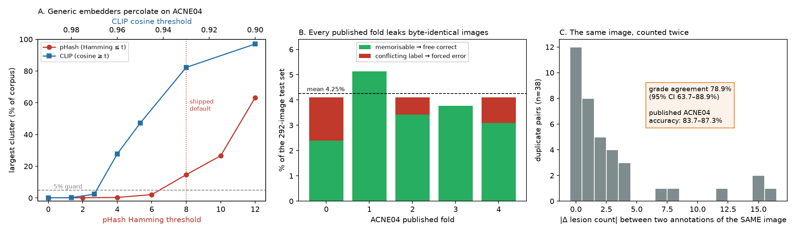

# A data-quality audit of ACNE04

**Run 2026-08-19** on the archive distributed from `github.com/xpwu95/LDL`
(`Classification.tar`, 1.13 GB, SHA of the extracted image set recorded in
`data/splits/dedup_report.json`). Every number below is reproducible from the scripts
in this repository against that archive; none of it requires a model, a GPU, or a
judgement call.

We went looking for near-duplicates because our own splitter refused to proceed
(§2). We found something larger, and it bears on every published number on this
benchmark.

---

## Summary

| Finding | Measurement |
|---|---|
| Byte-identical duplicate images | **38 groups, 76 of 1,457 files (5.2%)** |
| Duplicate groups with **conflicting severity labels** | **8 of 38 (21%)** |
| Duplicate groups with **conflicting lesion counts** | **26 of 38 (68%)** |
| Grade agreement between two annotations of the *same image* | **78.9%** (95% Wilson CI **63.7–88.9%**) |
| Exact lesion-count agreement on the same image | **31.6%** |
| Mean train/test leakage in the **dataset's own published 5-fold splits** | **4.25%** of each test set |
| — of which free correct answers (labels agree) | 3.56% |
| — of which forced errors (labels conflict) | 0.68% |
| Files whose `levleN` filename prefix disagrees with the label | **42 of 1,457** |
| **Distinct individuals in the 1,457 images (ArcFace)** | **~550–750** |
| — test images sharing a *person* with training, published folds, cosine ≥ 0.85 | **15.9%** (chance rate 0.019%) |
| — the same at the ordinary same-identity operating point (0.60) | **77.5%** |
| **Independent expert re-annotation (ACNE04-v2, n=1,204 shared images)** | |
| — lesions counted per image, v1 vs v2 | **8.4 vs 26.9 (3.2× more)** |
| — Spearman *rho* between the two counts | **0.471** |
| — grade agreement under ACNE04's own labelling function | **30.1%** (QWK 0.296) |
| — grade agreement after optimal monotone rescaling | **58.2%** (QWK 0.480) |
| — share graded severe or worse, v1 vs v2 | **11.7% vs 46.4%** |
| Published accuracy on this benchmark | **83.7–87.3%** |

Two things are the point.

**Reported ACNE04 accuracies sit at or above the dataset's own annotation
self-consistency** (78.9%), measured on images the dataset annotated twice without
realising it.

And more seriously: **the severity label is a property of the annotation team, not of
the photograph.** A second expert team re-annotating the same 1,204 images counts 3.2×
more lesions, ranks the images differently (Spearman *rho* 0.471), and — after being
granted any monotone recalibration it likes, which removes the entire definitional
component — still agrees with the original grade on only 58% of images. An ACNE04
accuracy figure measures agreement with one team's counting convention. §4.



---

## 1. The dataset contains 38 exact duplicates

Grouping all 1,457 files by MD5 of the file bytes yields 38 groups of size 2 — 76
files, 5.2% of the corpus. These are not near-duplicates or re-encodes; they are the
same bytes under two filenames, and in most cases under two *different* filename
prefixes (`levle0_120.jpg` and `levle1_486.jpg`).

Decoding to pixels and hashing again yields exactly the same 38 groups, so there are
no additional re-encoded copies hiding behind different compression.

## 2. Generic perceptual and semantic embedders cannot find them safely

Our splitter is group-aware: it refuses to break a duplicate cluster across splits.
That makes it sensitive to over-clustering, and on ACNE04 with the shipped default
(pHash Hamming ≤ 8) it produced a single cluster holding **214 images, 14.7% of the
corpus**, and the guard fired.

Sweeping the threshold shows a percolation transition rather than a plateau:

| pHash Hamming ≤ | linked pairs | groups | largest cluster |
|---|---|---|---|
| 0 | 38 | 1,419 | 2 (0.1%) |
| 2 | 42 | 1,415 | 2 (0.1%) |
| 4 | 62 | 1,397 | 5 (0.3%) |
| 6 | 193 | 1,281 | 31 (2.1%) |
| **8** (shipped default) | **720** | **1,001** | **214 (14.7%)** |
| 10 | 2,567 | 675 | 388 (26.6%) |
| 12 | 7,256 | 480 | 922 (63.3%) |

Visual inspection of sampled pairs at each distance settles what the numbers imply:
at Hamming 0 the pairs are the byte-identical duplicates; at 4 roughly a third are the
same subject and the rest are different people; at 6 and beyond they are overwhelmingly
different people who happen to share the dataset's single pose. **pHash is matching the
ACNE04 capture protocol — half-face at ~70°, dark background, similar lighting — not
duplication.** Every image in this dataset looks like every other image to a perceptual
hash.

CLIP ViT-B/32 fails the same way for the same reason. The median pairwise cosine
across the whole corpus is **0.83**, and percolation starts at 0.96:

| CLIP cosine ≥ | linked pairs | groups | largest cluster |
|---|---|---|---|
| 0.99 | 40 | 1,417 | 2 (0.1%) |
| 0.98 | 58 | 1,400 | 3 (0.2%) |
| 0.97 | 255 | 1,246 | 35 (2.4%) |
| 0.96 | 1,448 | 844 | 405 (27.8%) |
| 0.95 | 6,335 | 525 | 688 (47.2%) |

Calibration point: all 38 byte-identical pairs sit at CLIP cosine **1.0000**, so 0.99
recovers exactly the exact duplicates plus two extra links.

**Consequence for our protocol.** We set `phash_max_hamming: 2` and
`embed_min_cosine: 0.98`, which together give 1,400 groups with a largest cluster of 3
(0.2%) — comfortably inside the 5% guard — and we state the residual risk plainly:
*neither instrument detects same-subject-different-photograph.* We ran that analysis
separately with a face-identity embedding, and it turned out to be the largest finding
in this document -- see §5.

## 3. The published 5-fold splits leak, in every fold

ACNE04 ships fixed splits (`NNEW_trainval_{0..4}.txt` / `NNEW_test_{0..4}.txt`),
1,165 train / 292 test each. Intersecting the 38 duplicate groups against each fold:

| Fold | duplicate groups straddling train/test | leaked test images | free correct | forced errors |
|---|---|---|---|---|
| 0 | 12 | 12 (4.1%) | 7 (2.4%) | 5 (1.7%) |
| 1 | 15 | 15 (5.1%) | 15 (5.1%) | 0 |
| 2 | 12 | 12 (4.1%) | 10 (3.4%) | 2 (0.7%) |
| 3 | 11 | 11 (3.8%) | 11 (3.8%) | 0 |
| 4 | 12 | 12 (4.1%) | 9 (3.1%) | 3 (1.0%) |
| **mean** | | **4.25%** | **3.56%** | **0.68%** |

Across all five folds, 62 distinct images appear in some test split while a
byte-identical copy sits in the corresponding training split.

A model that memorises its training set therefore receives, on average, **3.56% of the
test set for free** and is **guaranteed to fail on another 0.68%** where the duplicate
carries a different label. Deep networks memorise small training sets readily, so the
free fraction is not hypothetical. This does not explain the whole 83.7–87.3% band, but
it is a systematic upward bias of a few points sitting inside every number ever reported
on these splits, and no paper we verified mentions it.

## 4. Two expert teams, the same 1,204 photographs, and a 3.2x difference in lesion count

The duplicates give a within-release reproducibility estimate on 38 images. A second,
independent measurement is available and is far better powered.

The AcneAI team (Gazeau, Nguyen et al., MICCAI 2024) re-annotated ACNE04 and released
**ACNE04-v2**: 1,204 of the original images with **32,443 lesion annotations**, against
the original's 18,983 across 1,457 images. Original filenames are preserved, so the two
annotations can be joined image by image. All 1,204 v2 filenames are present in v1.

| | v1 (Wu et al., ICCV 2019) | v2 (AcneAI, MICCAI 2024) |
|---|---|---|
| lesions per image, mean | 8.4 | **26.9** |
| lesions per image, median | 6 | **19** |
| maximum | 64 | **434** |
| images graded severe or worse | 11.7% | **46.4%** |

**v2 finds 3.2x more lesions on average, and more on 90.1% of the shared images.**
Pearson *r* between the two counts is **0.550**; Spearman *rho* is **0.471**.

### 4.1 Part of this is definitional, and that part is legitimate

The two teams were not counting the same thing, and both are internally reasonable.

Hayashi et al. (*J Dermatol* 35:255-260, 2008) established the grading criterion ACNE04
uses by correlating dermatologists' global severity judgements against lesion counts on
half the face. The bands are 0-5 mild, 6-20 moderate, 21-50 severe, >50 very severe,
and they are defined over **inflammatory eruptions -- papules plus pustules**. The paper
is explicit that global severity **did not correlate with the number of comedones**,
which is why comedones are excluded.

AcneAI states a deliberately different protocol: they annotate "all lesions, either acne
or non-acne lesions that look like acne," including "all acne lesions, even the tiny
ones," with comedones named explicitly among the small lesions marked with a circle.

So a large gap is expected. **The problem is not that the teams disagree; it is that
ACNE04's release specifies a count and a grade without specifying which lesions were
counted**, so a second expert team could not reproduce the first team's numbers even
approximately, and neither the dataset nor any downstream paper we verified states the
lesion definition the labels depend on.

### 4.2 The definitional part does not explain the disagreement

If the difference were purely a matter of counting additional lesion types, the ratio
would be roughly constant and the *rank order* of images by severity would be preserved.
Neither holds.

The per-image ratio has a median of 3.50 but an interquartile range of 2.00-6.64 and a
10th-to-90th-percentile span of **11.5x**. On **8.3% of images v2 found fewer lesions
than v1**. The ratio is also strongly count-dependent:

| v1 count band | n | median v2/v1 ratio |
|---|---|---|
| 1-2 | 345 | **8.00** |
| 2-5 | 310 | 5.50 |
| 5-7 | 264 | 3.00 |
| 7-11 | 360 | 2.65 |
| 11-64 | 272 | **2.00** |

To remove the definitional component entirely, we allow an *arbitrary monotone
rescaling*: re-band the v2 counts by quantile matching so that the v2 grade
distribution is identical to v1's by construction. Any residual disagreement cannot be
attributed to "they counted more lesion types."

| | grade agreement | quadratic weighted kappa |
|---|---|---|
| v2 counts under ACNE04's own Hayashi banding | **30.1%** | 0.296 |
| v2 counts after optimal monotone rescaling | **58.2%** | **0.480** |

After the rescaling, 58.2% of images get the same grade, **38.5% differ by one grade
and 3.2% by two or more**. A weighted kappa of 0.48 is moderate agreement. Restricting
to images with more lesions -- where relative counting noise should be smaller -- does
not help: Spearman *rho* is 0.376 on images with v1 count >= 5 and 0.297 on those with
count >= 20. (Range restriction attenuates *rho*, so these are not directly comparable
to the full-sample 0.471; the point is only that the disagreement does not vanish on the
images where counting should be most stable.)

### 4.3 What this means for the benchmark

Applying ACNE04's own labelling function to a second expert team's counts changes the
grade of **70% of the images** and moves the share of severe-or-worse cases from 11.7%
to 46.4%. Even after granting the second team any monotone recalibration they like,
the two labellings agree on 58%.

A model trained and evaluated on ACNE04 therefore predicts *the grade that Wu et al.'s
counting protocol assigns*, not acne severity in any transferable sense. That is a
perfectly valid object of study, but it is not what the benchmark is used to claim, and
it bounds what an ACNE04 accuracy figure can support:

- **Cross-dataset and clinical-deployment claims are unsupported by ACNE04 accuracy
  alone.** The label does not transfer to another expert team's reading of the same
  photographs.
- **Differences of one to three accuracy points between methods are not interpretable**
  as differences in severity assessment. They are differences in fitting one team's
  counting threshold.
- **The tail is where it is worst.** v1 grades 11.7% of shared images severe or worse;
  v2's counts put 46.4% there. Per-class results on the severe grades, which is where
  the clinical value sits, rest on the least stable part of the labelling.

### 4.4 Limits of this comparison

We compute v2 grades by applying the Hayashi banding to v2's counts. **AcneAI does not
do this** -- they use a continuous 0-100 severity score built from per-lesion severity
and area, and report ICC 0.8 for their own method. Applying Hayashi bands to their
counts is our construction, not theirs, and it is clinically incorrect on its face
precisely because their counts include comedones. That is the intended demonstration:
it shows how much the benchmark's published label depends on an unspecified counting
convention. It is not a criticism of AcneAI's annotations, which are more complete than
v1's by design and by their own account.

We also cannot separate "team A missed lesions" from "team B over-segmented" without a
third annotation. The claim here is symmetric and does not require assigning fault:
**two expert annotations of the same 1,204 photographs do not induce the same severity
ordering**, and the benchmark provides no basis for preferring one.

## 5. ACNE04 is about 600 people, not 1,457 photographs — and every published split ignores that

Section 2 flagged that neither perceptual hashing nor CLIP detects the same subject
photographed twice, and that ACNE04's capture protocol makes repeat subjects plausible.
It does more than that.

We embed every image with ArcFace (InsightFace `buffalo_l`). One practical note first,
because it is a trap: **face detection fails on 91% of ACNE04 raw**. These are close
crops in which the face fills the frame, and RetinaFace expects a face to occupy a
fraction of the image. Padding the border by 60% of the long side raises detection from
**9.3% to 96.1%** (1,400 of 1,457 images). Any pipeline that runs a face detector over
this dataset without padding will conclude, silently and wrongly, that it contains
almost no faces.

### 5.1 The identity structure

Union-find over ArcFace cosine gives, across a wide and stable threshold band:

| cosine ≥ | subjects | images in a multi-image subject | largest subject |
|---|---|---|---|
| 0.75 | 753 | 886 (63%) | 21 |
| 0.70 | 638 | 1,037 (74%) | 21 |
| 0.65 | 577 | 1,132 (81%) | 22 |
| **0.60** | **550** | **1,177 (84%)** | **22** |
| 0.50 | 525 | 1,206 (86%) | 22 |
| 0.45 | 482 | 1,228 | 111 ← percolates |

The structure is stable from 0.75 down to 0.50 and collapses at 0.45, which is the
signature of a real clustering rather than a threshold artefact. **ACNE04's 1,457
images are on the order of 550–750 distinct individuals**, most photographed two or
three times — different angles, sessions and lighting. Visual inspection of the largest
clusters confirms this directly: they are unmistakably one person each.

The 38 byte-identical pairs sit at cosine 1.000, as they must, which calibrates the
instrument.

### 5.2 Leakage, stated as conservatively as we can

Transitive closure can chain, so we report the version that cannot: a test image counts
as leaked only if **it is itself above threshold to some individual training image**.
No clusters, no chaining. Alongside it we give the chance rate — the share of *all*
image pairs in the corpus above that threshold — so the false-positive budget is visible.

| cosine ≥ | chance rate | fold 0 | 1 | 2 | 3 | 4 | **mean** |
|---|---|---|---|---|---|---|---|
| 0.85 | 0.019% | 12.1 | 19.1 | 16.6 | 14.1 | 17.5 | **15.9%** |
| 0.80 | 0.058% | 33.2 | 43.3 | 37.9 | 33.1 | 38.2 | **37.1%** |
| 0.75 | 0.120% | 53.9 | 63.8 | 58.5 | 51.8 | 59.3 | **57.5%** |
| 0.70 | 0.191% | 65.0 | 71.3 | 70.0 | 59.9 | 71.1 | **67.4%** |
| 0.60 | 0.273% | 74.3 | 83.7 | 80.5 | 70.1 | 78.9 | **77.5%** |

At cosine 0.85, where fewer than one pair in five thousand qualifies by chance,
**15.9% of every published ACNE04 test fold is a photograph of somebody who also
appears in the training fold** — roughly 800× the chance rate. At the ordinary
same-identity operating point the figure is 57–78%.

This dwarfs the byte-duplicate leakage of §3. It is not a handful of images: it is most
of the test set.

### 5.3 Our first splits leaked too

Our deduplicated image-level splits carry 8.3% / 50.7% / 74.5% at cosine 0.85 / 0.75 /
0.60 — no better than the published folds, because deduplication and identity grouping
answer different questions. Grouping by identity as well (604 subjects, largest 22
images) brings it to **0.0%** at cosine 0.60 and above, and the splits stay well
formed: 948 / 218 / 291 with every class present in every split.

One honest caveat: grouping at threshold *T* guarantees disjointness above *T* only.
At cosine 0.50 the subject-disjoint test split still shows 3.2% — pairs that fall
between 0.50 and 0.60 can straddle the boundary by construction. Dropping the grouping
threshold removes those but coarsens the grouping, and below about 0.45 the clustering
percolates. We take 0.60 and report the residual rather than choosing a threshold that
makes the number zero.

### 5.4 Why this matters more than the duplicate count

Acne severity is graded from lesion counts on *half* the face, so two photographs of one
person from different sides legitimately carry different grades. The leakage is
therefore not simple label copying, which would be easy to dismiss. It is worse in a
subtler way: a model can learn *this individual's skin, complexion, hair, background and
capture session* and carry that to the test set, where the same person appears with a
different lesion count. Nothing about that generalises to a new patient, which is the
only thing an acne grader is for.

Two consequences:

1. **Published ACNE04 accuracies measure within-subject generalisation, not
   between-subject generalisation.** They answer "given other photographs of this
   person, can you grade this one?" — not "given a new patient, can you grade them?"
   Only the second is clinically meaningful.
2. **The size of the effect is measurable, and we measure it.** §7 reports the same
   classifier, the same hyperparameters, the same budget, trained and evaluated on
   image-level splits and on subject-disjoint splits. The difference is the leakage
   bonus, in points.

## 6. The labels are derived, and the derivation exposes the noise

The label file rows are `<filename> <grade> <lesion_count>`. For all 1,457 records the
grade is exactly the Hayashi banding of the count — 1–5 → 0, 6–20 → 1, 21–50 → 2,
>50 → 3, with **zero** exceptions. The severity label carries no information beyond the
count; all annotation noise originates in counting.

That makes the duplicates a free repeat-annotation experiment. The same image, counted
twice, without the annotators knowing it was the same image:

- **Exact count agreement: 12 of 38 (31.6%).**
- Median |Δcount| = 1, mean 3.0, maximum 16.
- Median *relative* difference 22%.
- **Grade agreement: 30 of 38 (78.9%)**, 95% Wilson CI **63.7–88.9%**.

All 8 grade disagreements are cases where the two counts fall in different Hayashi
bands. Four straddle the 5/6 boundary; four straddle 20/21. The 20/21 cases are not
boundary jitter — they are (9 vs 21), (8 vs 24), (7 vs 22), (9 vs 24), differences of a
factor of 2.4–3. Their filenames form consecutive runs
(`levle1_16/20/22/23` ↔ `levle2_150/151/152/153`), which is the signature of a block of
images ingested twice and counted by different procedures rather than of individual
annotator slips.

**This is the finding with teeth.** ACNE04's own labels reproduce at 78.9% when the
identical photograph is annotated a second time. Published accuracies on the benchmark
are 83.7% (Wu et al.'s baseline), 84.11% (Label Distribution Smoothing), 86.06%
(KIEGLFN) and 87.33%. The upper end of the self-consistency confidence interval is
88.9%, so these results are not *impossible* — but they are being scored against a
label function that is itself unreliable at roughly the rate they are claiming to
improve upon, and the 4.25% leakage pushes in the same direction. Reported
improvements of 0.4 points (83.70 → 84.11) are far inside this noise.

Caveat stated up front: n = 38 is small and the interval is wide. The 78.9% is an
*estimate of annotation reproducibility*, not a hard ceiling, and duplicates may not be
a random sample of the corpus. The correct reading is not "these papers are wrong" but
"this benchmark cannot currently resolve differences of a few points, and nobody has
been reporting that."

## 7. The filename prefix is not a label

**42 of 1,457 files** have a `levleN` prefix that disagrees with their labelled grade
(e.g. `levle1_151.jpg` is labelled grade 0 with 4 lesions). Any pipeline that derives
labels from filenames — a natural shortcut given the naming scheme — gets 2.9% of the
dataset wrong. Our loader reads the label files and ignores the prefix.

---

## 8. What this changes for our study

1. **Dedup config is now `phash_max_hamming: 2`, `embed_min_cosine: 0.98`, CLIP
   embedder enabled.** The shipped defaults were tuned for datasets where perceptual
   hashing has signal; on a single-pose face corpus they do not.
2. **We do not use the published folds.** Protocol §3.2 already required splitting
   after deduplication on our own seed; this audit turns that from hygiene into a
   necessity, since the published folds leak.
3. **The comparison to the 83.7–87.3% band is now heavily qualified.** Our real-only
   arm is trained on de-duplicated, leak-free splits and is scored with balanced
   accuracy. It should be expected to land *below* the published band for three
   compounding reasons — no leakage bonus, a harder metric, and a smaller training set
   after deduplication — and that is not evidence of a broken pipeline.
4. **The annotation-noise estimate becomes a reference line in our results.** If the
   synthetic-substitution curve's decline is smaller than the label noise, we cannot
   claim to have measured it. 78.9% grade reproducibility is the number to beat before
   any effect of a few points is interpretable.
5. **Same-subject leakage remains unmeasured** and is the next thing to run. It is the
   one channel that could still be inflating both our numbers and the literature's.

## 9. Publishability

Sections 1, 3, 4 and 5 are a self-contained contribution independent of the synthetic
data question: a benchmark used by a substantial acne-grading literature contains 5.2%
exact duplicates, leaks ~4.25% of every published test split, has 21% grade
disagreement on its own repeated images, and ships 42 misleading filenames. None of it
requires a model. All of it is checkable in minutes by anyone with the archive.

Two things to do before claiming priority: search for an existing ACNE04 audit (we
found none in the 2026-08-19 literature pass, but absence of evidence from one pass is
weak), and run the same-subject analysis in §6.5 so the audit is complete rather than
partial.

## Reproducing

```
make prepare CONFIG=configs/acne04_closed.yaml   # writes data/splits/dedup_report.json
python scripts/audit_acne04.py                   # the tables above
python scripts/make_acne04_audit_figure.py       # docs/examples/acne04_audit.png
```
